# 🤖 Hybrid Chatbot and Agent System

A sophisticated hybrid AI system that intelligently routes user queries between a lightweight conversational LLM and a powerful ReAct Agent equipped with specialized tools. Built with LlamaIndex and Gradio.

## 📊 Architecture

```mermaid
graph LR
    subgraph UI["🖥️ User Interface"]
        Web[Gradio Web UI]
    end

    subgraph Core["🤖 Hybrid Core"]
        Router[Query Router<br/>LLM Classifier]
        Basic[Basic Chat<br/>Module]
        Agent[ReAct Agent<br/>Module]
        Memory[Memory Buffer<br/>40k tokens]
    end

    subgraph LLM["🦙 Language Model"]
        Ollama[Ollama<br/>Gemma 3 27B]
    end

    subgraph Tools["🛠️ Agent Tools"]
        Search[Web & Academic<br/>DuckDuckGo, Wiki, Arxiv]
        Math[Mathematics<br/>Add, Sub, Mul, Div]
        Media[Media Processing<br/>YouTube, Whisper]
        Vision[Image Analysis<br/>Multimodal Caption]
        Files[File Handler<br/>Excel, JSON]
        Weather[Weather API<br/>Weatherstack]
    end

    subgraph External["☁️ External Services"]
        OllamaServer[Ollama Server<br/>via Cloudflare]
        APIs[External APIs<br/>Weatherstack]
    end

    Web -->|User Query| Router
    Router -->|BASIC| Basic
    Router -->|AGENT| Agent
    
    Basic -->|Simple Chat| Ollama
    Agent -->|Reasoning| Ollama
    Agent <-->|Context| Memory
    
    Agent -->|Select Tool| Search
    Agent -->|Select Tool| Math
    Agent -->|Select Tool| Media
    Agent -->|Select Tool| Vision
    Agent -->|Select Tool| Files
    Agent -->|Select Tool| Weather
    
    Ollama <-->|API Call| OllamaServer
    Vision -.->|Multimodal| OllamaServer
    Weather -->|Request| APIs
    Files -.->|Download| APIs
    
    Basic -->|Response| Web
    Agent -->|Response| Web

    style Router fill:#FF9800,stroke:#E65100,stroke-width:3px,color:#fff
    style Basic fill:#00BCD4,stroke:#0097A7,stroke-width:3px,color:#fff
    style Agent fill:#4CAF50,stroke:#2E7D32,stroke-width:3px,color:#fff
    style Ollama fill:#2196F3,stroke:#1565C0,stroke-width:3px,color:#fff
    style Memory fill:#E91E63,stroke:#C2185B,stroke-width:3px,color:#fff
    style Web fill:#9C27B0,stroke:#6A1B9A,stroke-width:3px,color:#fff
    style OllamaServer fill:#673AB7,stroke:#4527A0,stroke-width:3px,color:#fff
    style Search fill:#607D8B,stroke:#37474F,stroke-width:2px,color:#fff
    style Math fill:#607D8B,stroke:#37474F,stroke-width:2px,color:#fff
    style Media fill:#607D8B,stroke:#37474F,stroke-width:2px,color:#fff
    style Vision fill:#607D8B,stroke:#37474F,stroke-width:2px,color:#fff
    style Files fill:#607D8B,stroke:#37474F,stroke-width:2px,color:#fff
    style Weather fill:#607D8B,stroke:#37474F,stroke-width:2px,color:#fff
    style APIs fill:#795548,stroke:#5D4037,stroke-width:2px,color:#fff
```



## ✨ Key Features

### 🎯 Intelligent Query Routing
- **Smart Classification**: LLM-powered router analyzes each query and classifies it as `BASIC` (simple conversation) or `AGENT` (complex task requiring tools)
- **Optimized Performance**: Simple queries get fast responses; complex queries leverage full agent capabilities

### 💬 Dual-Mode Processing

#### Basic Chat Mode
- Handles general conversation, greetings, and simple Q&A
- Direct connection to Ollama LLM for fast responses
- Maintains conversation history for context

#### Agent Mode
- **LlamaIndex ReAct Agent**: Advanced reasoning with multi-step tool orchestration
- **Asynchronous Execution**: Non-blocking tool calls for better performance
- **Persistent Memory**: 40,000 token context window for extended conversations

### 🛠️ Comprehensive Tool Suite

| Category | Tools | Description |
|----------|-------|-------------|
| **Web Search** | DuckDuckGo, Wikipedia, Arxiv | Real-time information retrieval from multiple sources |
| **Mathematics** | Add, Subtract, Multiply, Divide | Basic arithmetic operations with error handling |
| **Weather** | Weatherstack API | Current weather information for any location |
| **Media Processing** | YouTube Downloader, Whisper Transcriber, Image Captioner | Download and analyze video/audio/image content |
| **File Handling** | File Downloader, Excel/JSON Parser | Retrieve and process structured data files |

## 🛠️ Technologies Used

### Core Framework
- **LlamaIndex**: ReAct Agent framework for tool orchestration
- **Gradio**: Interactive web-based chat interface
- **Ollama**: Local LLM inference (Gemma 3 27B model)

### AI & ML
- **Whisper**: OpenAI's speech-to-text model for audio transcription
- **LLaMA Index Tools**: Pre-built integrations for Wikipedia, DuckDuckGo, Arxiv

### Python Libraries
- **asyncio & nest_asyncio**: Asynchronous execution
- **requests**: HTTP client for API calls
- **Pillow (PIL)**: Image processing
- **pandas**: Data manipulation and Excel handling
- **yt-dlp**: YouTube video/audio downloading

### External Services
- **Cloudflare Tunnel**: Secure access to Ollama server
- **Weatherstack API**: Weather data provider

## 📥 Installation

### Prerequisites

1. **Ollama Server**: Install and run Ollama with the Gemma 3 27B model
   ```bash
   ollama pull gemma3:27b
   ```

2. **Python 3.8+**: Ensure Python is installed

3. **yt-dlp**: Required for YouTube downloads
   ```bash
   pip install yt-dlp
   ```

### Install Dependencies

```bash
pip install -r requirements.txt
```

## ⚙️ Configuration

Create a `.env` file in the project root:

```env
CLOUDFLARE_TUNNEL_URL=https://your-ollama-tunnel-url/
OLLAMA_MODEL_ID=gemma3:27b
WEATHER_API=your-weatherstack-api-key
```

Update `agent.py` and `app.py` to load environment variables:

```python
import os
from dotenv import load_dotenv

load_dotenv()

CLOUDFLARE_TUNNEL_URL = os.getenv("CLOUDFLARE_TUNNEL_URL")
OLLAMA_MODEL_ID = os.getenv("OLLAMA_MODEL_ID", "gemma3:27b")
WEATHER_API = os.getenv("WEATHER_API")
```

### Configuration Variables

| Variable | Files | Example Value | Purpose |
|----------|-------|---------------|---------|
| `CLOUDFLARE_TUNNEL_URL` | `app.py`, `agent.py` | `"https://your-tunnel.com/"` | Public endpoint for Ollama service |
| `OLLAMA_MODEL_ID` | `app.py`, `agent.py` | `"gemma3:27b"` | LLM model identifier |
| `WEATHER_API` | `agent.py` | `"your-api-key"` | Weatherstack API key |

## 🚀 Usage

Start the application:

```bash
python app.py
```

The Gradio interface will launch at `http://127.0.0.1:7860`

### Example Queries

**Basic Mode (Fast Response):**
- "Hello, how are you?"
- "Tell me a joke"
- "What is Python?"

**Agent Mode (Tool-Powered):**
- "What's the current population of Turkey?" (Web Search)
- "What's the weather in Istanbul?" (Weather API)
- "Calculate 125 × 47" (Math Tool)
- "Download and transcribe this YouTube video: [URL]" (Media Tools)
- "Analyze this image: image.jpg - What objects are in it?" (Image Captioner)

## 🏗️ Project Structure

```
Hibrit_Chatbot_with_llamaindex/
├── app.py                 # Main Gradio application with routing logic
├── agent.py               # ReAct Agent setup and tool definitions
├── deneme.py              # Test/demo script
├── requirements.txt       # Python dependencies
├── system_prompt.txt      # Agent system instructions
└── README.md              # This file
```

## 🧰 Available Tools

### 1. Web Search Tools
- **DuckDuckGo Search**: General web search
- **Wikipedia**: Encyclopedia lookups
- **Arxiv**: Academic paper search

### 2. Mathematical Tools
- **add_tool**: Addition operations
- **subtract_tool**: Subtraction operations
- **multiply**: Multiplication operations
- **divide_tool**: Division with zero-check

### 3. Weather Tool
- **my_weather_tool**: Fetches current weather via Weatherstack API

### 4. Media Processing Tools
- **youtube_video_download**: Downloads YouTube videos
- **youtube_transcript**: Extracts audio and generates transcript
- **mp3_transcript**: Transcribes audio files using Whisper
- **image_captioner**: Analyzes images with multimodal LLM

### 5. File Tools
- **File_Download_Tool**: Downloads and parses Excel/JSON files

## 🛑 Troubleshooting

| Issue | Cause | Solution |
|-------|-------|----------|
| `ConnectionError` | Ollama unreachable | Verify Ollama is running and tunnel URL is correct |
| `ValueError: ReActAgent has no field "memory"` | Memory assignment error | Use `memory.reset()` and `memory.put()` methods |
| `AttributeError: ChatMessage has no attribute 'get'` | Wrong return type | Ensure agent returns `str(response)` |
| Agent loses context | Token limit too low | Increase `token_limit` in `ChatMemoryBuffer.from_defaults()` |
| Weather tool fails | Invalid API key | Verify Weatherstack API key in `.env` |
| YouTube download fails | yt-dlp not installed | Install: `pip install yt-dlp` |

## 🔒 Security Best Practices

⚠️ **Never commit API keys or secrets to version control!**

1. Store sensitive values in `.env` file
2. Add `.env` to `.gitignore`
3. Use environment variables in code
4. Share `.env.example` template instead

### Example `.gitignore`

```gitignore
# Environment
.env
.env.local

# Python
__pycache__/
*.pyc

# Media downloads
*.mp3
*.mp4
audio.mp3
video.mp4
```

## 📝 How It Works

1. **User Input**: Query submitted via Gradio interface
2. **Routing**: LLM router analyzes query complexity
3. **Processing**:
   - **Basic**: Direct LLM response for simple queries
   - **Agent**: ReAct loop with tool selection and execution
4. **Memory Management**: Conversation history maintained in buffer
5. **Response**: Final answer streamed back to user

### Agent Reasoning Flow

```
Query → Agent Thinks → Selects Tool → Executes Tool → 
Evaluates Result → [Loop if needed] → Final Answer
```

## 🎯 Use Cases

- **Research Assistant**: Search academic papers, Wikipedia, web
- **Data Analyst**: Download and analyze Excel/JSON files
- **Weather Reporter**: Real-time weather information
- **Content Analyzer**: Transcribe videos, caption images
- **Calculator**: Complex mathematical operations
- **Conversation Partner**: General chat and Q&A

## 🤝 Contributing

Contributions are welcome! Areas for improvement:
- Add more specialized tools
- Implement streaming responses
- Add logging and monitoring
- Create unit tests
- Optimize token usage

## 📄 License

This project is open-source and available under the MIT License.

## 🙏 Acknowledgments

- **LlamaIndex**: For the excellent agent framework
- **Gradio**: For the intuitive UI library
- **Ollama**: For local LLM inference
- **OpenAI Whisper**: For speech recognition

---

**Built with ❤️ using LlamaIndex, Gradio, and Ollama**
